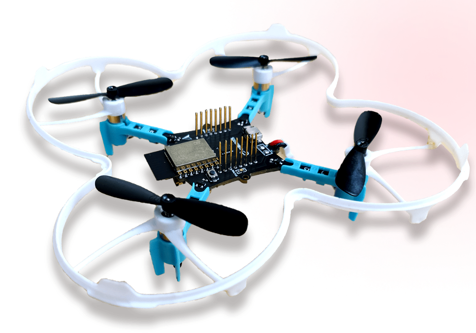

# XFly_UK
Research and experiments on Xfly, a nano drone platform by Qubebots. This repository documents the research and experimental findings using Xfly drones, focusing on various applications and performance metrics. Ideal for fellow researchers and enthusiasts in the field of drone technology.

